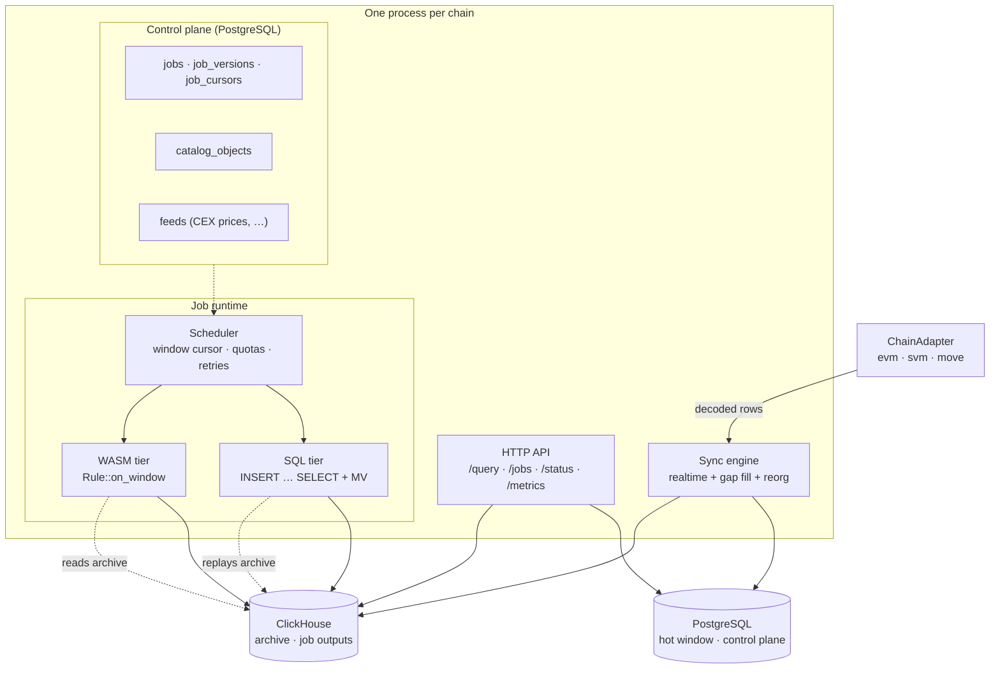
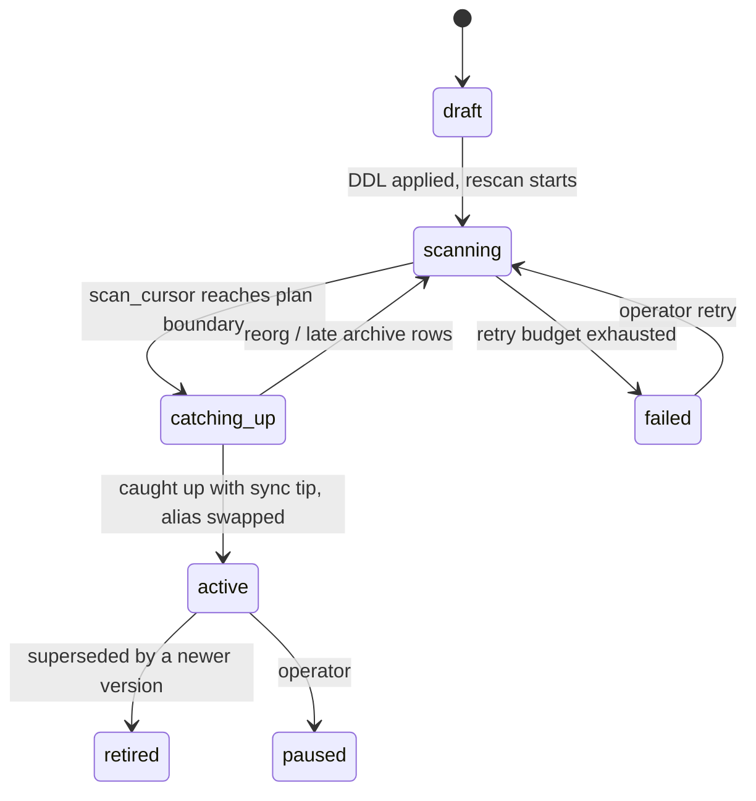

# Multi-chain indexer with a pluggable job engine

Status: design proposal (not implemented)
Date: 2026-09-22
Target repository: this workspace (`sui-indexer`)
Reference implementation studied: `tempoxyz/tidx` v0.7.0 (local copy at `/Volumes/akext/tmp/tidx`)

> **Scope note.** This document proposes turning the Sui-only, single-pipeline indexer into a
> multi-chain indexer that hosts *N user-defined indexing jobs* inside **one process per chain**.
> It is a design and migration plan; no code changes are described as complete.

## Contents

1. [Goals and non-goals](#1-goals-and-non-goals)
2. [What the reference implementation gets right](#2-what-the-reference-implementation-gets-right)
3. [Coupling points that block generalization](#3-coupling-points-that-block-generalization)
4. [Target architecture](#4-target-architecture)
5. [Data model](#5-data-model)
6. [The job engine](#6-the-job-engine)
7. [Chain adapters](#7-chain-adapters)
8. [Storage, catalog and query](#8-storage-catalog-and-query)
9. [Migration plan](#9-migration-plan)
10. [Deployment and operations](#10-deployment-and-operations)
11. [Worked examples](#11-worked-examples)
12. [Risks and trade-offs](#12-risks-and-trade-offs)
13. [Decisions and open questions](#13-decisions-and-open-questions)
14. [Appendix A: reference file map](#appendix-a-reference-file-map)
15. [Appendix B: glossary](#appendix-b-glossary)

---

## 1. Goals and non-goals

### Requirements

| # | Requirement | Consequence for the design |
|---|-------------|----------------------------|
| R1 | Support chains beyond Ethereum/Sui — first target is **Solana**, for MEV analysis | Chain-specific RPC and decoding must be isolated behind an adapter; the sync engine must not know chain types |
| R2 | Detection logic can be added or changed at runtime, and a change must trigger a **full-chain re-scan** | Jobs are data (rows in a control-plane table), outputs are **versioned physical tables** with an atomic alias swap |
| R3 | Many independent data conditions (arbitrage, sandwich, later DEX arb, CEX-DEX arb) co-exist and are cheap to add | A shared decoded substrate plus a dynamic catalog so adding a condition is a config/DB operation, not a code change |
| R4 | **One indexer process per chain**, never one process per strategy | In-process job scheduler with resource isolation; no per-rule containers |

### Non-goals

- Replacing the existing Sui event pipeline in one step. Phase P0 is a behaviour-preserving refactor.
- Storing raw RPC payloads for arbitrary retroactive re-decoding (cost is prohibitive; see §12.1).
- Multi-tenant authorization beyond the existing trusted-CIDR admin gate.

### Design invariants

1. **Height is the universal cursor.** Every chain exposes a monotone integer height (block number, slot, checkpoint sequence). Reorg detection, gap filling, partitioning, pruning and job cursors are all expressed over it.
2. **The adapter's contract is decoded rows, not raw blocks.** The engine never sees a chain-native type.
3. **Re-scan happens inside the archive, not against RPC**, except when the *base decoder* itself changes (§6.5).
4. **Job output schemas are immutable per version.** A logic change creates a new table; the old one is retired, never mutated in place.

---

## 2. What the reference implementation gets right

These mechanisms are chain-agnostic and should be ported rather than reinvented. Line references are
relative to the reference repository root (`/Volumes/akext/tmp/tidx`).

| # | Mechanism | Location | Why it is the foundation |
|---|-----------|----------|--------------------------|
| 1 | Integer-height cursor with three watermarks: `synced_num` (contiguous), `tip_num` (near head), `backfill_num` (reverse fill) | `db/sync_state.sql:1-38` | Every chain is a monotone integer sequence; gap detection, reorg rollback and tier boundaries all derive from these three values |
| 2 | Dual-channel sync: realtime follows the head while a gap-filler fills holes newest-first, pausing when realtime lags more than 10 blocks | `src/sync/engine.rs:233-310`, `:872-1176` | Makes recent data queryable during a multi-month backfill; directly reusable |
| 3 | Parent-link validation with fork-point search and rollback (depth cap 128, then `tip_num` is rewritten to the fork point) | `src/sync/engine.rs:469-549` | Becomes `CommitmentModel`; Sui (final checkpoints) degenerates to a no-op, Solana uses it for `confirmed` |
| 4 | **Catalog-driven derived tables with ranged backfill** — a descriptor carries the DDL, dependencies, public visibility, block column and a `BackfillPolicy::Ranged { select_sql }`; a planner compares source and target row counts per 100k-block window and replays missing ranges | `src/clickhouse_schema/catalog.rs:8-129`, `src/sync/ch_sink.rs:502-562`, `:1822-1831` | This *is* the "re-scan when the logic changes" machinery. It needs runtime registration plus versioning, not a rewrite |
| 5 | Runtime DDL generation: `CREATE TABLE … AS <user SQL> LIMIT 0` → `CREATE MATERIALIZED VIEW …_mv TO target AS <user SQL>` → one-shot `INSERT … SELECT` backfill | `src/api/views.rs:296-327` | The only dynamic table-creation path in the reference codebase; extract it as the job output-table builder |
| 6 | Tiered storage with a **reversible** boundary: ClickHouse is the archive of record, Postgres keeps a hot window; the boundary only moves after the archive provably covers the range, then the tiered views are re-baked atomically | `src/db/tiered.rs`, `src/sync/tiered_sync.rs:258-353` | Lets re-scans read the archive instead of RPC, which is what makes R2 affordable |
| 7 | Batch write discipline worth copying verbatim | PG: temp staging table + `COPY … FROM STDIN BINARY` + `INSERT … ON CONFLICT DO NOTHING` in a single transaction (`src/sync/writer.rs:68-436`). CH: `RowBinary` + LZ4, 10k-row chunks, 3 retries, `insert_deduplication_token`, 30s/120s timeouts (`src/sync/ch_sink.rs:41,53-56,1378-1452`) | Both are already proven at chain scale and are chain-independent |

Two further practices are worth adopting from the reference project even though they are not
architectural: snapshot tests over generated SQL (45 `insta` snapshots under
`src/{api,query,service}/snapshots/`) and a single `catalog` module that every consumer queries
(`is_public_query_table`, `reorg_tables`, `derived_backfills`) instead of re-listing tables.

---

## 3. Coupling points that block generalization

| # | Blocker | Evidence (reference repo) | Action |
|---|---------|---------------------------|--------|
| B1 | RPC and decoding are hard-wired to EVM/Tempo | `src/tempo.rs:13-16` aliases `Block`/`Transaction`/`Receipt` to `TempoNetwork*`; `src/sync/decoder.rs` holds the only row constructors; `src/sync/fetcher.rs` issues `eth_getBlockByNumber` / `eth_getBlockReceipts` | Introduce `ChainAdapter` whose contract is decoded rows (§4.1) |
| B2 | Column definitions are duplicated in five places that must stay in lockstep: row structs ↔ PG `COPY` lists ↔ ClickHouse wire structs ↔ DDL files ↔ archive-read SQL | `src/types.rs:5-83`, `src/sync/writer.rs:68-436`, `src/sync/ch_sink.rs:1478-1700`, `db/*.sql`, `db/clickhouse/*.sql` | Skeleton tables (`blocks`, `txs`, `events`) get one descriptor each; chain-specific columns live in typed `native` tables or an `extra` map |
| B3 | The catalog is compile-time `&'static` data | `src/clickhouse_schema/mod.rs:13-60` | Move to a `catalog_objects` table, bootstrapped from embedded SQL and extended at runtime by jobs |
| B4 | Query allow-lists are hard-coded, and the ClickHouse engine pins the database | `src/query/validator.rs:11` (four PG tables), `:437-443` (single-part name must exist in the static catalog), `src/clickhouse.rs:214-219` (`database=tidx_{chainId}`) — the last one makes objects created by `/views` in `analytics_{chainId}` unreachable | Allow-list = core tables ∪ `catalog_objects.public`; support schema-qualified ClickHouse names |
| B5 | Re-scan can only *fill gaps*, never *recompute*: when a definition drifts the MV is dropped and recreated, but historical rows keep the old definition (the code warns about this) | `src/sync/ch_sink.rs:383-435` | Versioned output tables plus an alias view (§6.4) |
| B6 | Hot reload only *adds* chains; edits and removals are silently ignored. `sync_state` is keyed by `chain_id` alone, and sink metrics watermarks carry no `chain_id` label | `src/config/watcher.rs:115-156`, `db/sync_state.sql:1`, `src/metrics.rs:328-336` | Reconciler with start/stop/update; `jobs`/`job_versions` own their cursors; every metric labelled with `chain` and `job` |

Current state of this workspace against the same axes (see §9 for the plan):

| Axis | Today |
|------|-------|
| Chains | One `NetworkConfig`; one process per network; no chain-kind discriminator |
| Pipeline | Static `EventProcessor` injected once at construction; pipeline name hard-coded `"default"` |
| Storage | PostgreSQL only; `events_v2` is the canonical decoded substrate; no columnar store |
| DDL | Five static `sqlx::migrate!` migrations; no runtime DDL anywhere |
| Retention | `DELETE … WHERE checkpoint_sequence < $1`; no partitioning |
| Reorg | None needed (Sui checkpoints are final); continuity is verified through `prev_digest` |
| Re-scan | `Backfill --from --to` and `Rewind --to` only; no versioned outputs |
| Query | SELECT-only gateway with a hard-coded 7-table allow-list and a substring table check |
| Reusable today | `repair_queue` (durable, `SKIP LOCKED`, exponential backoff) and the `archive_lo`/`archive_hi`/`hot_boundary` columns in `indexer_progress` |

---

## 4. Target architecture

### 4.1 Layering



### 4.2 Four core abstractions

**A. `ChainAdapter` — the contract is rows, not blocks.** Decoding lives inside the adapter so the engine stays chain-neutral:

```rust
#[async_trait]
pub trait ChainAdapter: Send + Sync {
    fn kind(&self) -> ChainKind;                 // Evm | Svm | Move
    fn commitment(&self) -> CommitmentModel;     // Reorgable { max_depth } | Final
    fn schema(&self) -> &ChainSchema;            // native tables + column descriptors

    async fn head(&self) -> Result<u64>;
    /// Batched fetch *and* decode. The engine never sees a chain-native block type.
    async fn fetch(&self, range: Range<u64>) -> Result<Vec<DecodedBlock>>;
    /// Parent reference used for fork detection (EVM parent hash,
    /// SVM parent_slot + prev_blockhash, Sui prev_digest).
    fn parent_ref(&self, block: &DecodedBlock) -> ParentRef;
}

pub struct DecodedBlock {
    pub height: u64,
    pub hash: [u8; 32],
    pub parent: ParentRef,
    pub ts: DateTime<Utc>,
    pub commitment: Commitment,      // Pending | Confirmed | Final
    pub rows: CoreRows,              // blocks + txs skeleton rows
    pub events: Vec<Ev>,             // universal event projection
    pub native: Vec<RowSet>,         // chain-specific rows (EVM receipts, SVM account deltas, …)
}
```

Because the adapter returns rows, every reference-implementation call site of
`decode_block` / `decode_transaction` / `decode_log` / `decode_receipt`
(`src/sync/engine.rs:593-645, 665-691, 1396-1443`) collapses into a single `adapter.fetch()`
call, and gap filling, reorg handling, pruning and tiering become chain-independent.

**B. Universal event projection (`events`).** One table that all three chain families map into, so chain-agnostic rules are written once:

| Column | EVM | Solana | Sui / Move |
|--------|-----|--------|------------|
| `emitter` | log `address` | `program_id` | `package::module` |
| `topics[]` | `topic0..3` | `[8-byte discriminator, anchor event name?]` | `[event_type]` |
| `payload` | `data` | instruction data (incl. inner instructions) | BCS bytes |
| `tx_hash` | tx hash | signature | transaction digest |
| `extra` | — | `inner_ix`, `stack_height`, `cu`, `priority_fee`, `tip` | `sender`, `checkpoint` |

Chain-native tables remain, but only for chain fidelity and state reconstruction. The rule
substrate is `events`. The reference project proves this works: `token_transfers`, `dex_pairs`,
`dex_orders` and `dex_fills` are all derived from the single `logs` table
(`db/clickhouse/*_select.sql`).

**C. Dynamic catalog.** Replaces the compile-time catalog with a control-plane table (§8.2). Consequence: "add a new data condition" becomes an insert plus a DDL apply, and reorg pruning / public query visibility / backfill policy are all derived from catalog metadata instead of hard-coded lists.

**D. Commitment and reorg policy.**

```rust
enum Commitment { Pending, Confirmed, Final }       // column on `blocks`
enum ReorgMode  { BlockScoped, Refreshable, None }  // declared per job output
```

`Refreshable` outputs are fully recomputed each pass and are therefore reorg-correct by construction —
the reference project uses this for `dex_ohlc_1m` and marks it `block_column: None`
(`src/clickhouse_schema/dex.rs:93-103`). `BlockScoped` outputs are pruned above the fork point
along with the base tables.

---

## 5. Data model

### 5.1 Skeleton tables (chain-independent)

```sql
CREATE TABLE blocks (
    height      BIGINT      NOT NULL,
    hash        BYTEA       NOT NULL,
    parent_hash BYTEA       NOT NULL,
    parent_ref  JSONB       NOT NULL,   -- chain-specific parent identity
    ts          TIMESTAMPTZ NOT NULL,
    commitment  SMALLINT    NOT NULL,   -- 0 pending, 1 confirmed, 2 final
    chain_meta  JSONB       NOT NULL,   -- producer, gas/compute, slot flags, …
    PRIMARY KEY (height)
) PARTITION BY RANGE (height);
```

`txs` and `events` follow the same shape: `(height, block_ts, tx_index, …)` with `chain_meta`
for the rest. Chain-specific columns are never added to skeleton tables.

### 5.2 Native tables (per chain family)

| Family | Native tables | Notes |
|--------|---------------|-------|
| `move` (Sui) | `checkpoints`, `transactions`, `objects`, `coin_flows` | Already present; map onto skeleton `blocks` = checkpoints |
| `svm` (Solana) | `account_deltas`, `program_logs`, `rewards` | Inner instructions are first-class in `events` via `extra.inner_ix` |
| `evm` | `receipts`, `logs` | `logs` can be a materialized projection of `events` filtered to `emitter_type = 'log'` |

### 5.3 Job outputs

```sql
-- physical, immutable per version
CREATE TABLE job_sandwich__v3 ( … , _height BIGINT, _commitment SMALLINT) ENGINE = ReplacingMergeTree
  ORDER BY (slot, ix_idx) PARTITION BY toYYYYMM(block_ts);
-- stable alias consumed by queries and downstream services
CREATE OR REPLACE VIEW job_sandwich AS SELECT * FROM job_sandwich__v3;
```

Every job output carries `_height` so reorg cleanup and incremental scan windows work uniformly,
plus `_rule_version` for lineage.

---

## 6. The job engine

### 6.1 A job is data, not a process

```toml
[[jobs]]
name        = "solana-sandwich"
version     = 3                       # bumped, or derived from spec_hash
source      = "events"                # events | txs | native.<table> | feed.<name>
tier        = "wasm"                  # sql | wasm
window      = { lookback = 1, lookahead = 0 }        # height context needed
filter      = { emitters = ["raydium…", "orca…", "meteora…"],
                topics   = ["<swap discriminator>"] }
scan        = { from = 0, to = "head", chunk = 10_000, priority = "backfill" }
output      = { table = "job_sandwich", order_by = ["slot", "ix_idx"],
                engine = "ReplacingMergeTree", partition_by = "toYYYYMM(block_ts)",
                ttl = "180d", reorg_mode = "block_scoped", pg_hot = "7d" }
state       = "none"                  # none | kv
runtime     = { fuel = 5_000_000_000, max_memory_mb = 512, max_rows_per_window = 100_000 }
```

R1–R4 map directly onto this:

- R2 "rescan the whole chain from zero" → `scan.from = 0` with a new `version`.
- R2 "logic changed, scan again" → change code or spec, `version += 1`, the scheduler builds the new version and swaps the alias when it catches up.
- R3 "add arbitrage / DEX arb / CEX-DEX arb" → one more `[[jobs]]` entry or one `POST /jobs` call.
- R4 "one indexer per chain" → the job list is a table, not a deployment unit.

### 6.2 Two execution tiers

Most detections do not need code, and keeping them declarative keeps them cheap and hot-loadable.

| | SQL tier | WASM tier |
|---|---|---|
| Use when | filtering, joins, aggregation, arithmetic over event fields; most arbitrage metrics | cross-transaction or cross-block reasoning; path reconstruction; sandwich ordering; anything needing pool state |
| Execution | `INSERT INTO <target> SELECT … FROM events WHERE height >= lo AND height < hi` (the reference implementation's `ranged_backfill_sql`, `src/sync/ch_sink.rs:1822-1831`) plus an MV for live inserts | driver reads an archive window, calls `rule.on_window(ctx)`, writes the returned rows |
| Hot-loadable | yes (pure SQL) | yes (wasmtime instantiation) |
| Cost | very low — archive-local scan, zero RPC | medium — one host call per window |

### 6.3 Host ABI for the WASM tier

```rust
pub trait RuleCtx {
    fn abi_version(&self) -> u32;
    fn window(&self) -> &[Ev];                        // lookback + current + lookahead
    fn blocks(&self) -> &[BlockMeta];                 // fees, compute units, tips
    fn kv(&self) -> &dyn Kv;                          // height-scoped MVCC, rollback-safe
    fn feed(&self, name: &str, at_height: u64) -> Option<&FeedSlice>;
    fn emit(&self, row: OutRow);
}

#[async_trait]
pub trait Rule: Send + Sync {
    fn spec(&self) -> RuleSpec;
    async fn on_window(&self, ctx: &dyn RuleCtx) -> Result<Vec<OutRow>>;
}
```

Keep the ABI narrow and versioned (`abi_version`). Do not expose Rust types or `serde` structs as the ABI; use a compact, explicitly specified encoding.

### 6.4 Versioned outputs and atomic swap

```mermaid
sequenceDiagram
    participant U as Operator / API
    participant S as Scheduler
    participant CH as ClickHouse
    participant Q as Query surface
    U->>S: apply job spec (version = v3)
    S->>S: spec_hash differs from v2 → plan rescan
    S->>CH: CREATE TABLE job_sandwich__v3 (+ MV for live rows)
    loop ranges of `chunk` heights
        S->>CH: INSERT INTO job_sandwich__v3 SELECT … WHERE height ∈ [lo, hi)
        S->>S: persist cursor (job_cursors)
    end
    S->>S: wait until v3 catches up with the sync tip
    S->>CH: CREATE OR REPLACE VIEW job_sandwich AS SELECT * FROM job_sandwich__v3
    Note over Q: readers switch atomically; no empty window
    S->>CH: mark v2 retired (DROP after retention)
```

This is the fix for blocker B5. The reference project's drift handling recreates the materialized
view but leaves historical rows under the old definition (`src/sync/ch_sink.rs:383-435`); physical
per-version tables make the re-scan observable and reversible, and let a bad rule version be retired
without data loss.

### 6.5 Re-scan paths

| Path | Trigger | Mechanism | RPC cost |
|------|---------|-----------|----------|
| A | Only rule/derived logic changed | Ranged `INSERT … SELECT` inside ClickHouse, chunked, cursor persisted, rate-limited, cancellable | **zero** |
| B | Base *decoder* changed for a bounded range | `adapter.fetch(from..to)` to rewrite the base rows for that range, then trigger downstream path A | bounded |
| C | Base capture predicate changed (new program set, new chain) | Rebuild the base layer into a new family (`core_v2.*`) using the existing gap-filler | full chain, one-off |

Path C is the expensive case, which is why the base capture must be **broad enough** the first time
(for example: capture all instructions of the monitored program set, not just the swap instruction).
This is exactly the trade-off the reference project made by storing every log in `logs`.

### 6.6 Control plane schema

```sql
CREATE TABLE jobs (
    chain_id     BIGINT NOT NULL,
    name         TEXT   NOT NULL,
    spec         JSONB  NOT NULL,       -- canonical job spec
    spec_hash    TEXT   NOT NULL,       -- spec + code digest
    desired      TEXT   NOT NULL,       -- active | paused | retired
    PRIMARY KEY (chain_id, name)
);

CREATE TABLE job_versions (
    chain_id     BIGINT  NOT NULL,
    name         TEXT    NOT NULL,
    version      INT     NOT NULL,
    spec_hash    TEXT    NOT NULL,
    status       TEXT    NOT NULL,      -- draft|scanning|catching_up|active|failed|retired
    scan_from    BIGINT  NOT NULL,
    scan_to      BIGINT,
    scan_cursor  BIGINT,
    rows_written BIGINT  NOT NULL DEFAULT 0,
    last_error   TEXT,
    started_at   TIMESTAMPTZ NOT NULL DEFAULT now(),
    finished_at  TIMESTAMPTZ,
    PRIMARY KEY (chain_id, name, version)
);
```

Job lifecycle:



### 6.7 Scheduling, backpressure and isolation

- One reconciler loop owns desired state: `loop { desired = load_jobs(); diff(desired, running); start/stop/update(CancellationToken) }`.
  This replaces the add-only watcher of the reference implementation (`src/config/watcher.rs:115-156`).
- Freshness beats backfill: realtime sync has priority; job scans run on a separate concurrency quota and share the same rate limiter as the gap-filler (the `ThrottledPool` pattern from `src/db/pool.rs:82-132`).
- Per-job quotas: WASM fuel and memory, write rows/second, maximum rows per window; a job that exceeds its budget is failed and quarantined, never allowed to starve the sync engine.
- Failure handling: exponential backoff with a retry cap, then `failed`; the archive cursor means a retry resumes rather than restarts.
- Cancellability: every scan loop checks its cancellation token between chunks so a hot update stops the old version promptly.

---

## 7. Chain adapters

### 7.1 Mapping table

| Concern | EVM | Solana (`svm`) | Sui (`move`) |
|---------|-----|----------------|--------------|
| Height | block number | slot | checkpoint sequence |
| Batch fetch | `eth_getBlockByNumber` + `eth_getBlockReceipts` | `getBlock(slot, {transactionDetails:"full", rewards:false, maxSupportedTransactionVersion:0})` | existing `get_full_checkpoint` |
| Parent link | `parent_hash` | `parent_slot` + `previous_blockhash` | `prev_digest` (already stored) |
| Reorg model | `Reorgable { max_depth: 128 }` | `Reorgable` over `confirmed`, `Final` at finalized | `Final` (no rollback path) |
| Event source | logs (`address`, `topics`, `data`) | instructions incl. inner, plus `logMessages` | Move events (`package::module`, BCS) |
| Decode | ABI signatures | program events and Anchor discriminators | BCS + type layout |

### 7.2 Solana-specific constraints

These are not implementation details; they change what the system can promise, so they must be settled before P6.

| Topic | Constraint | Design response |
|-------|-----------|-----------------|
| **Historical availability** | A stock RPC node retains roughly the last two days of slots. "Scan the whole chain from zero" is therefore *impossible* against a normal endpoint | Decide the historical source up front: a self-hosted full-history node (ledger/BigTable import) or a provider with full history. Treat the initial full capture as a one-off, one-time cost (path C) and keep every later re-scan inside the archive (path A) |
| Skipped slots | `getBlock` returns `null` for skipped slots; this is normal, not an error | The gap detector must distinguish "skipped" (record a marker, do not retry) from "missing data" (retry). A `skipped` flag on `blocks` makes this explicit |
| Commitment | `confirmed` ≈ 0.4–1 s, `finalized` ≈ 13 s | Run detection at `confirmed` with block-scoped rollback; expose `min_commitment` per job so latency-insensitive jobs can wait for `final` |
| Inner instructions | MEV patterns live in inner instructions and their ordering, not only top-level ones | Store inner instructions in `events` with `extra.inner_ix` and `extra.stack_height`; never discard them |
| Decoding | Program events (Raydium/Orca/Meteora swap events carrying amounts) vs Anchor IDL discriminators | Prefer event-derived detection where amounts are present — it avoids account-state reads entirely. Use an IDL/discriminator table for programs that emit nothing useful |
| Pool state | Reserves change per slot; reading account state per slot is expensive | Default to stateless detection from event amounts. If true state is required, add a dedicated `pool_state` job (`state = "kv"`, snapshot + delta, height-scoped rollback) and let other jobs read it |
| Sandwich / arbitrage shape | Sandwich: same pool, same direction, victim between the attacker's two legs. Arbitrage: multi-hop swaps in one transaction where `Σ out − Σ in − fee − priority_fee − tip > 0` | Both need only instruction ordering, amounts and fees — they are WASM-tier jobs |

### 7.3 Adapter registration

```rust
pub fn registry() -> HashMap<ChainKind, Arc<dyn ChainAdapterFactory>>;
// "sui"   -> adapter-move
// "solana"-> adapter-svm
// "evm"   -> adapter-evm (optional, later)
```

The chain kind is config data (`[chain] kind = "solana"`), so adding a chain never touches the sync engine, the job engine or the query layer.

---

## 8. Storage, catalog and query

### 8.1 Tiers

| Tier | Role | Contents |
|------|------|----------|
| PostgreSQL | hot window, control plane, low-latency point reads | `jobs`, `job_versions`, `job_cursors`, `catalog_objects`, `feeds`, recent partitions of `blocks`/`txs`/`events`, optional `pg_hot` mirrors of job outputs |
| ClickHouse | archive of record and all derived/job data | full `blocks`/`txs`/`events`, native tables, every `job_*__vN` table, refreshable aggregates |

The boundary is a height (`pruned_below`) plus its timestamp. It moves only when the archive covers
everything below it, then the tiered views are re-baked. `indexer_progress` in this workspace already
carries `archive_lo`/`archive_hi`/`hot_boundary`, so the accounting exists; what is missing is the
columnar store and the ranged backfill executor.

### 8.2 Dynamic catalog

```sql
CREATE TABLE catalog_objects (
    chain_id     BIGINT NOT NULL,
    name         TEXT   NOT NULL,
    kind         TEXT   NOT NULL,   -- table | view | matview | refreshable_mv
    ddl          TEXT   NOT NULL,
    select_sql   TEXT,
    checksum     TEXT   NOT NULL,
    public       BOOLEAN NOT NULL DEFAULT false,
    block_column TEXT,              -- non-null ⇒ participates in reorg pruning
    reorg_mode   TEXT   NOT NULL,   -- block_scoped | refreshable | none
    owner_job    TEXT,              -- cascade retirement
    backfill     TEXT,              -- ranged | none | refresh
    PRIMARY KEY (chain_id, name)
);
```

Every consumer that the reference project hard-codes reads this table instead:
`reorg_tables()`, `is_public_query_table()`, `derived_backfills()` (`src/clickhouse_schema/mod.rs:66-88`).
This is the mechanism behind R3: a new data condition is a catalog row plus a job row.

### 8.3 Query surface

| Concern | Change |
|---------|--------|
| Allow-list | `core tables ∪ catalog_objects WHERE public` — replaces the 7-table const and the substring check |
| ClickHouse schema qualification | Support `database.table`; do not pin the database to a single value so `analytics_*` / `job_*` databases are reachable |
| Tiered routing | Extend the tier splitter to job tables that declare `pg_hot`; everything else is ClickHouse-only and routes natively |
| Generated DDL tests | Snapshot-test all generated SQL (DDL, MV, ranged backfill, CTEs) with `insta`, following the reference project's 45 snapshot files |
| Admin API | `GET/POST/PUT/DELETE /jobs`, `POST /jobs/{name}/rescan`, `POST /jobs/{name}/retire`, `GET /jobs/{name}/plan` (dry run), behind the existing trusted-CIDR gate plus an `x-indexer-admin: 1` header |

---

## 9. Migration plan

Each phase is independently shippable and behaviour-preserving until the phase that changes behaviour.
Verification commands per phase: `just format`, `just lint`, `just test`, `just mutation`.

| Phase | Deliverable | Key work | Reuse from reference | Done when |
|-------|-------------|----------|----------------------|-----------|
| **P0** Foundation | Chain-neutral engine, no behaviour change | New `crates/chain-core` (height cursor, gap detection, contiguous commit, reorg, rate limiting) and `crates/adapter-move` (today's Sui fetch/decode behind `ChainAdapter`); split skeleton tables from native tables | `src/sync/engine.rs` structure; `ThrottledPool` (`src/db/pool.rs:82-132`) | Existing tests green; `cargo mutants` shows no new survivors; Sui pipeline unchanged |
| **P1** Control plane | Job registry and work queue | `jobs`/`job_versions`/`job_cursors`/`catalog_objects`; generalise `repair_queue` into a `work_queue(range)`; reconciler replaces static processor injection | `config/watcher.rs` (as a cautionary example) | A no-op job can be added and removed without a restart |
| **P2** Dynamic catalog | Runtime DDL and dynamic visibility | DDL apply + checksum drift detection from `catalog_objects`; allow-list driven by `public`; `CREATE TABLE … AS SELECT … LIMIT 0` generator | `src/sync/ch_sink.rs:204-451`, `src/api/views.rs:296-327` | After `job apply`, the new table is queryable through `/query` with no code change |
| **P3** SQL tier and ranged re-scan | Declarative jobs with full-history backfill | Chunked `INSERT … SELECT` executor with cursor persistence, rate limiting, split-on-failure; versioned output tables; alias swap | `plan_derived_backfills`, `ranged_backfill_sql`, `reorg_tables()` | A SQL job computes a full historical range, then swaps the alias on catch-up |
| **P4** ClickHouse archive | Tiered storage | Introduce ClickHouse: core and job outputs land there; PG keeps the hot window and control plane; optional `pg_hot` mirrors; tiered query routing | `src/db/tiered.rs`, `src/query/tiered_split.rs`, `src/sync/ch_sink.rs` write path | Wide analytical queries hit ClickHouse, point lookups hit PG, and a re-scan performs zero RPC calls |
| **P5** WASM tier | Stateful/complex detections | `rule-host` (wasmtime, fuel metering, versioned ABI, `RuleCtx`), height-scoped KV store, external `feeds` | — | Sandwich and arbitrage rules are hot-loaded as `.wasm`, scan the full chain, and are rollback-safe |
| **P6** Solana adapter | Proof the abstraction holds | `crates/adapter-svm`: batched fetch, skipped-slot markers, inner instructions, discriminator decoding, `events` projection | `src/sync/fetcher.rs` batching/adaptive splitting; all sync logic | Switching `ChainKind` requires only a new adapter — engine, jobs and query layers are untouched |

Test strategy per phase, following this workspace's rules: unit tests colocated, `proptest` for
adapter decoding and rule-window boundaries, `insta` snapshots for generated SQL, integration tests
in crate-level `tests/`, and `just mutation` after the inner loop is green. Adapter property tests
should assert that *any* decoded block round-trips through `events` without losing ordering
(`height`, `tx_index`, `ev_index`), because ordering is what MEV detection depends on.

---

## 10. Deployment and operations

### 10.1 Shape

```
compose (one config file per chain)
├── postgres          control plane + hot window
├── clickhouse        archive + job outputs
├── indexer-<chain>   1 container = 1 chain = sync + N jobs + API + metrics
└── (optional) prometheus + grafana
```

Adding a strategy is a CLI/API call, not a new container:

```bash
sui-indexer job apply -f sandwich.toml      # create or bump version
sui-indexer job plan  -f sandwich.toml      # dry run: DDL + estimated scan size
sui-indexer job ls --chain solana           # version, status, cursor, rows, lag
sui-indexer job rescan sandwich --from 0    # explicit re-scan
sui-indexer job retire sandwich --version 2
```

### 10.2 Observability

Per-chain and per-job labels are mandatory (the reference implementation's sink watermarks omit
`chain_id`, which makes multi-chain dashboards wrong — do not repeat that):

| Metric | Labels |
|--------|--------|
| `indexer_job_scan_height`, `indexer_job_lag` | `chain`, `job`, `version` |
| `indexer_job_rows_written_total` | `chain`, `job`, `version`, `table` |
| `indexer_job_scan_duration_seconds`, `indexer_job_window_duration_seconds` | `chain`, `job` |
| `indexer_job_failures_total`, `indexer_job_quarantined` | `chain`, `job`, `reason` |
| `indexer_rpc_requests_total`, `indexer_sink_write_rows_total` | `chain`, `sink`, `table` |

Runbooks to document alongside the API: "a rule version is producing wrong rows" (pause → retire version → swap alias back to the previous version), "scan is too slow" (raise concurrency quota or narrow the capture filter), "reorg observed at confirmed" (verify block-scoped pruning for every job output).

---

## 11. Worked examples

### 11.1 Arbitrage — SQL tier

```sql
-- dex_swaps is the output of a shared SQL job (computed once, reused by several rules)
INSERT INTO job_arbitrage__v1
SELECT
    s.slot            AS slot,
    s.tx_hash         AS tx_hash,
    s.pool            AS pool,
    s.amount_in       AS amount_in,
    s.amount_out      AS amount_out,
    s.amount_out - s.amount_in - s.fee - s.priority_fee AS profit,
    1                 AS _rule_version,
    s.slot            AS _height
FROM dex_swaps AS s
WHERE s.slot >= {lo} AND s.slot < {hi}
  AND s.amount_out - s.amount_in - s.fee - s.priority_fee > 0;
```

CEX-DEX arbitrage is the same shape with one extra join against a feed table, which is why external
data sources must be first-class citizens with the same window/cursor semantics:

```sql
INSERT INTO job_cex_dex__v1
SELECT s.slot, s.tx_hash, s.pool, s.amount_in, s.amount_out,
       s.amount_out * f.price_usd - s.amount_in * s.usd_in - s.fee AS profit,
       1, s.slot
FROM dex_swaps AS s
JOIN feed_binance_price AS f
  ON f.symbol = s.base_symbol AND f.bucket <= s.block_ts
WHERE s.slot >= {lo} AND s.slot < {hi};
```

### 11.2 Sandwich — WASM tier

```rust
fn on_window(&self, ctx: &dyn RuleCtx) -> Result<Vec<OutRow>> {
    let mut out = Vec::new();
    for blk in ctx.blocks() {
        let swaps: Vec<&Ev> = ctx.events().iter()
            .filter(|e| DEX_PROGRAMS.contains(&e.emitter) && is_swap(e))
            .collect();

        for pool in pools_of(&swaps) {
            let seq = sorted_by_outer_inner_index(pool, &swaps);   // ordering is the payload
            // front leg (same payer, price up) … victim (price up) … back leg (price down)
            if let Some((front, victim, back)) = find_sandwich(&seq) {
                let profit = front.amount_in as i128 * victim.price_impact_pct
                           - back.fee as i128 - front.tip as i128;
                if profit > 0 {
                    out.push(OutRow::sandwich(blk.height, front, victim, back, profit));
                }
            }
        }
    }
    Ok(out)
}
```

Note that both examples only need ordering, amounts and fees — they never read account state, which
keeps them stateless and cheap to re-run.

---

## 12. Risks and trade-offs

### 12.1 Full-chain re-scan cost

Path A (recompute inside the archive) is affordable, but path C (re-fetch and re-decode the whole
chain) is expensive and, on Solana, impossible against a stock RPC node. The mitigation is
architectural, not tactical: make the base capture broad enough once, then live in path A. Do not
promise "any rule can be reinterpreted against raw history"; either pay for a raw archive (huge:
hundreds of GB to tens of TB) or accept that base-decoder changes are a scoped, planned operation.

### 12.2 ClickHouse reorg cleanup

The reference implementation prunes by `ALTER TABLE … DELETE` with `mutations_sync = 1` plus a
verification `count()` (`src/sync/ch_sink.rs:1330-1373`). This is correct but expensive at high
throughput. Prefer `ReplacingMergeTree` with a version/height column and deduplicating on read, or
partition-granularity rollback (drop the affected day and re-insert), and keep `ALTER DELETE` off the
hot path.

### 12.3 Stateful rules

A height-scoped MVCC key/value store is the most complex component in this design. Keep rules
stateless where possible, restrict `state = "kv"` to true state (pool reserves), and require every
write to be tagged with a height so rollback is a range delete.

### 12.4 WASM ABI drift

Pin `abi_version`, keep the encoding explicit and documented, and support at least one previous ABI
version so a failed deployment can be rolled back without rebuilding rules.

### 12.5 Migration risk

P0 is a refactor of working code, so it must be verified as behaviour-preserving: same row counts,
same watermarks, same reorg outcomes. The `hexagonal` split (`chain-core` + `adapter-*`) is the
riskiest step and should land as a mechanical move with no logic edits, reviewed independently of
any new feature.

---

## 13. Decisions and open questions

### ADR-001: implement in this workspace, harvesting code from the reference project

**Decision (recommended).** Build the generalized indexer here, progressively, using the reference
implementation as an architectural source and as a direct source of the ClickHouse write path,
catalog/backfill executor and tiered query routing.

**Why.** This workspace already has the modular crate layout (`config` → `events`/`storage` → `core` → `cli`),
the durable `repair_queue`, the canonical `events_v2` substrate and the `archive_lo`/`archive_hi`/`hot_boundary`
accounting. Forking the reference project would first require removing its EVM/Tempo coupling — work
with no product value.

**Alternative.** Fork the reference project and generalize it. Faster to a working ClickHouse tier,
but throws away the existing Sui pipeline, config surface and storage models.

### ADR-002: SQL tier before WASM tier

**Decision.** Ship declarative SQL jobs (P3) before the WASM host (P5).

**Why.** Most of R3's conditions are expressible in SQL, SQL jobs need no sandboxing or ABI design,
and P3 validates the job/version/alias lifecycle with much less machinery. The WASM tier then only
has to add execution, not redefine the lifecycle.

### ADR-003: ClickHouse is required for the archive tier

**Decision.** Adopt a columnar archive (ClickHouse) as the archive of record; keep PostgreSQL for the
hot window and control plane.

**Why.** Path A re-scans are only cheap inside a columnar store, and the reference implementation
demonstrates the operational model (retention, boundary, repair) end to end.

### Open questions

| # | Question | Impact |
|---|----------|--------|
| Q1 | Solana historical data source: self-hosted full-history node, ledger import, or a provider? | Blocks P6 and invalidates path C if not settled |
| Q2 | Which DEX programs and pools are in scope for the first sandwich/arbitrage rule? | Determines the capture filter and therefore the size of the base layer |
| Q3 | Is the existing Sui deployment expected to keep running unchanged during the refactor (dual-write, shadow reads)? | Decides whether P0 needs a compatibility shim |
| Q4 | Retention policy per job output (TTL) and whether PG hot mirrors are needed for any of them | Affects storage sizing in P4 |

---

## Appendix A: reference file map

| Reference module | Study it for |
|------------------|--------------|
| `src/sync/engine.rs` | realtime tick, gap-fill with `JoinSet` and split-on-failure, fork-point search, watermark updates |
| `src/sync/fetcher.rs` | hand-rolled batched JSON-RPC, adaptive split on "response too large", no retry at this layer |
| `src/sync/decoder.rs` | the single decode boundary to be replaced by `ChainAdapter` |
| `src/sync/writer.rs` | PG staging-table + `COPY BINARY` + `ON CONFLICT DO NOTHING` batch write |
| `src/sync/ch_sink.rs` | ClickHouse `RowBinary` writes, DDL checksum drift, `plan_derived_backfills`, ranged backfill SQL, reorg pruning |
| `src/sync/tiered_sync.rs`, `src/db/tiered.rs` | reversible hot/cold boundary, FDW foreign tables, hydration from archive |
| `src/sync/pruner.rs` | partition-granularity pruning with safety conditions |
| `src/clickhouse_schema/catalog.rs` | the derived-object descriptor and `BackfillPolicy::Ranged` |
| `src/clickhouse_schema/dex.rs`, `db/clickhouse/dex_*.sql` | how a decoded table + MV + backfill select is declared |
| `src/api/views.rs` | runtime DDL generation from user SQL |
| `src/query/{validator,router,tiered_split}.rs` | allow-listing, source routing, tier-split eligibility rules |
| `src/db/{schema,partitions}.rs` | idempotent migrations, weekly partitions, `CREATE INDEX CONCURRENTLY` handling |
| `src/config/watcher.rs` | the add-only hot reload that must become a reconciler |

## Appendix B: glossary

| Term | Meaning |
|------|---------|
| Height | Monotone integer cursor: block number (EVM), slot (Solana), checkpoint sequence (Sui) |
| Skeleton table | Chain-independent table (`blocks`, `txs`, `events`) with chain metadata in `chain_meta` |
| Native table | Chain-family-specific table kept for fidelity (receipts, account deltas, objects) |
| Universal event | Row in `events` mapping EVM logs, Solana instructions and Move events to one shape |
| Catalog object | A managed DDL object (table/view/MV) registered in `catalog_objects` |
| Job | A named, versioned detection/indexing unit with a source, window, filter and output |
| Versioned output | `job_<name>__v<N>` physical table; the stable name is a view alias |
| Path A/B/C | Recompute inside the archive / bounded RPC re-decode / full base rebuild |
| `pg_hot` | Per-job declaration to mirror recent output partitions into PostgreSQL |
